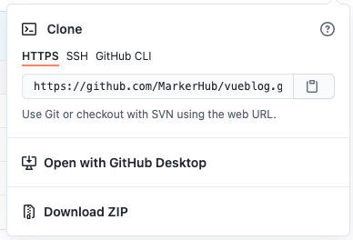

### 安装淘宝镜像 使用cnpm

注：若有"因为在此系统上禁止运行脚本“的错误，则需要使用管理员身份打开命令行

```shell
npm install -g cnpm --registry=https://registry.npm.taobao.org
cnpm
```

### 使用github镜像

例如，我要clone一个项目，（github好慢啊）



web url为`https://github.com/`MarkerHub/vueblog.git`


几个常用的镜像地址：

`https://github.com.cnpmjs.org/`

`https://hub.fastgit.org/`

那么我clone时，输入`https://hub.fastgit.org/MarkerHub/vueblog.git`即可

### npm的常用命令

### 1. `npm init`

 `npm init` 初始化一个空项目 ,默认配置使用 `npm init -y`,其实就是创建一个`package.json`文件。

### 2.`npm install`

```shell
- (根据.package.json中的dependencies自动安装依赖的包 )
先修改package.json,然后npm i最保险
  npm install 或 npm i
  
    
xxx -g 搜索并安装xxx（全局）。安装多个同上。
xxx -D 安装并将依赖信息写在package.json中的devDependencies中。
```

```shell
以less为例
- （安装指定版本）
npm i less@4.0.0
- （卸载）
npm uninstall less
```


### 3.`npm list` 列出已安装依赖（快捷方式：`ls`）

- 默认列出局部依赖。
- `npm list -g` 列出已安装的全局依赖。

### 4.`npm outdated` 检查过期依赖

### 5.`npm update` 更新依赖（快捷方式：`up`）

- `xxx` 局部更新xxx。
- `xxx -g` 全局更新xxx。

### 6.`npm root` 查看依赖安装路径（也就是`node_modules`的路径）

- 默认查看局部安装路径。
- `-g` 查看全局安装路径。

### 7.`npm view` 查看模块的注册信息

- `xxx versions` 列出`xxx`的所有版本， 如：`npm view jquery versions`。

- `xxx dependencies` 列出`xxx`的所有依赖， 如：`npm view gulp dependencies`。

  

### npm是啥？

当一个网站依赖的代码越来越多，程序员发现这是一件很麻烦的事情：

- 去 jQuery 官网下载 jQuery
- 去 BootStrap 官网下载 BootStrap
- 去 Underscore 官网下载 Underscore
- …

有些程序员就受不鸟了，一个拥有三大美德的程序员 [Isaac Z. Schlueter](https://github.com/isaacs) （以下简称 Isaaz）给出一个解决方案：用一个工具把这些代码集中到一起来管理吧！

这个工具就是他用 JavaScript （运行在 Node.js 上）写的 npm，全称是 Node Package Manager

Node.js内置了npm后大火。用 npm 来分享代码成了前端的标配。

命令行工具(CLI）


### Windows SHELL

you can use tab to autocomplete and save your time

use "cd" to open a folder

```shell
cd
cd ..
```

"dir" to see a directory.

```shel
dir \z<文件路径>
dir *.png         
```

"dir /a" to see all the files  which even contain the hidden files

```shell
dir /a 
```

"cls" to clear out the screen

```shell
cls
```

helper 

```shel
ipconfig
```

"mkdir"create a new folder

```shell
mkdir <folder name>
```

"rmdir"remove a directory which is empty.

```shell
rmdir <folder name>
rmdir /s <folder name>//强制删除
Y
```

to get your disk name like: then you can change your drives

C:

D:

E:

F:

```shell
//get your available disk name like
wmic logicaldisk get name
//enter the E:
E: 
```

```shel
color 0A  第一个是背景 第二个是字体
0->background color  A->font color
```


