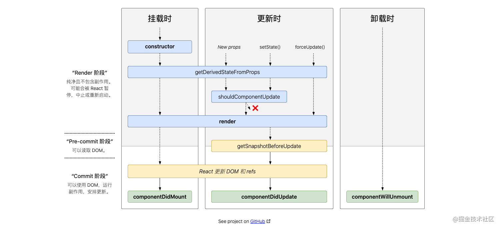

# React

单向数据流：`万物皆 Props`，主要通过 `onChange/setState()`的形式该更新数据，需要所以在 react 中需要关注受控组件的写法

```js
// 会报错，props的值不可修改
<input value={this.props.value}/>

// 在onChange调用setState修改数据,需要调用setState修改绑定数据
<input value={this.state.value} onChange={this.onChange}/>
复制代码
```

## 创建项目

### Create React App 

[Create React App](https://github.com/facebookincubator/create-react-app) 是一个用于**学习 React** 的舒适环境，也是用 React 创建**新的[单页](https://react.docschina.org/docs/glossary.html#single-page-application)应用**的最佳方式。

它会配置你的开发环境，以便使你能够使用最新的 JavaScript 特性，提供良好的开发体验，并为生产环境优化你的应用程序。你需要在你的机器上安装 [Node >= 8.10 和 npm >= 5.6](https://nodejs.org/en/)。要创建项目，请执行：

```shell

1 npm 安装 react
npm i -g create-react-app
2初始携带ts的react项目
npx create-react-app my-app	或
npx create-react-app my-app --template typescript

cd my-app
npm start
```

> 注意
>
> 第一行的 `npx` 不是拼写错误 —— 它是 [npm 5.2+ 附带的 package 运行工具](https://medium.com/@maybekatz/introducing-npx-an-npm-package-runner-55f7d4bd282b)。

Create React App 不会处理后端逻辑或操纵数据库；它只是创建一个前端构建流水线（build pipeline），所以你可以使用它来配合任何你想使用的后端。它在内部使用 [Babel](https://babeljs.io/) 和 [webpack](https://webpack.js.org/)，但你无需了解它们的任何细节。

## 受控组件


## 事件冒泡和事件捕获

### 事件流

事件流描述的是从页面中接受事件的顺序。但有意思的是，IE和Netscape开发团队居然提出了差不多完全相反的事件流的概念。IE的事件流是事件冒泡流，而Netscape Communicator的事件流是事件捕获流。


### 事件冒泡（event bubbling）

即事件开始时由最具体的元素接收，然后逐级向上传播到较为不具体的节点。

**所有现代浏览器都支持事件冒泡**，但在具体实现上还是有一些差别。IE5.5及更早版本中的事件冒泡会跳过`<html>`元素（从`<body>`直接跳到`document`）。IE9、Firefox、Chrome和Safari则将事件一致冒泡到window对象。


### 事件捕获（event capturing）

事件捕获的思想是不太具体的节点应该更早接收到事件，而最具体的节点应该最后接收到事件。

### 简而言之就是，捕获是父级元素先触发，而冒泡是子级元素先触发

**react中有默认的冒泡事件，而且有捕获事件，即结尾加了个capture**

***onDragEnter vs onDragEnterCapture，onDragLeave vs onDragLeaveCapture***

## react用 onChange  实现 v-modal双向绑定

如何获取输入框的值是react中必须面对的问题，目前比较好的方式与两种，一种是使用ref，而另一种是使用onChange事件，它通过事件对象的方式获取输入值。 
具体使用方式如下：

### onChange

```react
class Main extends Component{
    changeEvent(e){
        console.log(e.target.value);

    }
    render(){
        return (
            <div>
                <input type = 'text' onChange={(e)=>this.changeEvent(e)}/>
            </div>
        )
    }
}
```

## ref

### ref 回调函数

ref属性可以设置为一个回调函数，这也是官方强烈推荐的用法；这个函数执行的时机为：

- `组件被挂载后`，回调函数被立即执行，回调函数的参数为该组件的具体实例。
- `组件被卸载或者原有的ref属性本身发生变化时`，回调也会被立即执行，此时回调函数参数为`null`，以确保内存泄露。

```react
 RegisterStepTwo = React.createClass({
        getInitialState(){
          return {visible: true};
        },
      changeVisible(){
        this.setState({visible: !this.state.visible});
      },
      refCb(instance){
        console.log(instance);
      },
      render(){
        return(
          <div>
            <button type="button" onClick={this.changeVisible}>{this.state.visible ? '卸载' : '挂载'}ConfirmPass
            </button>
            {
              this.state.visible ?
                <ConfirmPass ref={this.refCb} onChange={this.handleChange}/>: null
             }
           </div>
         )
      }
    });

```

### ref 类属性 + React.createRef()

`ref`是`react`提供给我们的一个属性,通过它，我们可以访问 `DOM` 节点或者组件.

```react
// 父组件
import React from 'react'
import Son from './son'
import { Button } from 'antd'

class Father extends React.Component {
  son: any
  constructor(props) {
    super(props)
    this.son = React.createRef() // 在此处创建ref
  }
  clearSonInput = () => {
    const { current } = this.son // 注意，这里必须通过 this.son.current拿到子组件的实例
    current.clearInput()
  }
  render() {
    return (
      <div>
        <Son ref={this.son} />
        <Button type='primary' onClick={this.clearSonInput}>
          清空子组件的input
        </Button>
      </div>
    )
  }
}
export default Father

// 子组件
import React from 'react'
import { Button } from 'antd'

class Son extends React.Component {
  constructor(props) {
    super(props)
  }
  state = {
    info: 'son',
  }
  handleChange = (e) => {
    this.setState({
      info: e.target.value,
    })
  }
  clearInput = () => {
    this.setState({
      info: '',
    })
  }
  render() {
    return (
      <div>
        <div>{this.state.info}</div>
        <input type='text' onChange={this.handleChange} />
      </div>
    )
  }
}
export default Son;
```

> 值得注意的是，我们必须通过 `this.childRef.current`才能拿到子组件的实例。
> 使用 ref 常见的场景有管理焦点，文本选择或媒体播放、触发强制动画、集成第三方 DOM 库等。


## 生命周期



## Context

Context 设计目的是为了共享那些对于一个组件树而言是“全局”的数据，例如当前认证的用户、主题或首选语言。举个例子，在下面的代码中，我们通过一个 “theme” 属性手动调整一个按钮组件的样式：

```react
class App extends React.Component {
  render() {
    return <Toolbar theme="dark" />;
  }
}

function Toolbar(props) {
  // Toolbar 组件接受一个额外的“theme”属性，然后传递给 ThemedButton 组件。  
  // 如果应用中每一个单独的按钮都需要知道 theme 的值，这会是件很麻烦的事，  
  // 因为必须将这个值层层传递所有组件。  
  return (   
    <div>
      <ThemedButton theme={props.theme} />
    </div>  );
}

class ThemedButton extends React.Component {
  render() {
    return <Button theme={this.props.theme} />;
  }
}
```


使用 context, 我们可以避免通过中间元素传递 props：

`this.context` 与`React.createContext('值')`

```react
// Context 可以让我们无须明确地传遍每一个组件，就能将值深入传递进组件树。
// 为当前的 theme 创建一个 context（“light”为默认值）。

const ThemeContext = React.createContext('light');
class App extends React.Component {
  render() {
    // 使用一个 Provider 来将当前的 theme 传递给以下的组件树。    
    // 无论多深，任何组件都能读取这个值。    
    // 在这个例子中，我们将 “dark” 作为当前的值传递下去。    
    return (
      <ThemeContext.Provider value="dark">       
      		<Toolbar />
      </ThemeContext.Provider>
    );
  }
}

// 中间的组件再也不必指明往下传递 theme 了。
function Toolbar() {  
  return (
    <div>
      <ThemedButton />
    </div>
  );
}

class ThemedButton extends React.Component {
  // 指定 contextType 读取当前的 theme context。  
  // React 会往上找到最近的 theme Provider，然后使用它的值。  
  // 在这个例子中，当前的 theme 值为 “dark”。  
  static contextType = ThemeContext;
  render() {
    return <Button theme={this.context} />;  }
}
```


