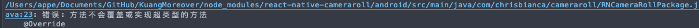
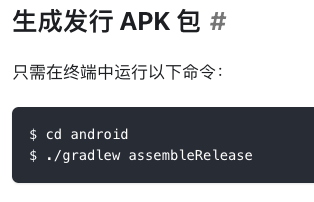

# iosM1环境搭建

我用的是mac-mini-m1版，ide用的是webstorm，全程挂梯子

首先需要安装Xcode，之后安 pod包管理工具

`brew install cocoapods`homebrew好像有些坑，如果需要link什么的就按homebrew上的提示来就行了，不过先安xcode貌似就没有bug了

之后新建项目

`npx react-native init AwesomeProject`

之后尝试一下运行

```shell
npm run ios
```


错误1:`error Failed to launch the app on simulator, An error was encountered processing the command (domain=com.apple.CoreSimulator.SimError, code=405):
Unable to lookup in current state: Shutdown`

不能打开模拟器，

解决方法：关闭模拟器，重新编译

错误2: 1 error: 

解决方法：https://github.com/aiba/react-native-m1配置m1环境

# 安装react navigation

错误1.

`Could not get BatchedBridge, make sure your bundle is packaged correctly`

解决：yarn或者npm install


错误：No bundle URL present.

Make sure you're running a packager server or have included a .jsbundle file in your application bundle.

解决：`cd ios 并且 pod install `或者重新启动一下


# 安装和使用iconfont图标

<a href="https://juejin.cn/post/6844903598883618829#heading-5">参考链接</a>

iOS需要将iconfont.ttf添加到工程里去，可以创建一个Fonts文件夹，将iconfont.ttf放入其中，再添加Fonts目录到工程中。在Info.plist中`Fonts provided by application`下添加一行iconfont.ttf。


安卓，Android放置在`app/src/main/assets/fonts`文件夹中，并且在`app/src/build.gradle`中添加配置:

```javascript
project.ext.vectoricons = [
    iconFontNames: [ 'iconfont.ttf' ]
]
```

```javascript
const icon = {
  fontFamily: 'iconfont',
  fontSize: 18,
  //fontWeight: 'bold',尽量不要调整宽度
  color: 'white',
};
```


使用：转义字符

```react
<Text style={icon}>&#xe67d;</Text>
<Text style={icon}>{'\u0e67d'}</Text>
```


如果用这种传参数，也可以用{props.icon}加载

# 几个快速掌握react navigation的demo

## 1.使用BottomTabNavigator底部导航栏


## 2.使用MaterialTopTabNavigator顶部导航栏

```react
import * as React from 'react';
import {createMaterialTopTabNavigator} from '@react-navigation/material-top-tabs';

const Tab = createMaterialTopTabNavigator();

export default function Activity() {
  return (
    <Tab.Navigator tabBarPosition="top" style={{marginTop: 0}}>
      <Tab.Screen name="Home" component={} />
      <Tab.Screen name="Profile" component={} />
    </Tab.Navigator>
  );
}
```

# 安装react antdesign mobile


错误：Could not get Batched bridge.

解决：8081端口被占用，全部重启即可

# 安装react-async-storage本地缓存

凌晨四点加这个包直接爆红，说这个RNcameraRoll编译不行


无论是`npm install @react-native-community/cameraroll  `还是

`yarn add @react-native-community/cameraroll     ` ，又或者`pod install`和`npx react-native link`均无法解决

索性直接上xcode去查报错，发现报错只有如下这个


于是又返回去查包


发现这个的名字并非是`RCT`而是`RNC`


改名后红色消失，直接可以正常编译了，这个拼写错误真的很让我无语


# android环境搭建

根据rn中文网配好android studio环境后

调试rn安卓的时候，又出现了问题，

根据build.gradle，安装


错误：Failed to find Platform SDK with path:platforms; android-25

(cameraroll这个包也有点老了吧)

解决：遇到这个报错就下一个对应25版本的SDK即可，也就80多MB

------


错误： SDK location not found. Define location with an ANDROID_SDK_ROOT environment variable or by setting the sdk.dir path in your project's local properties file at '/Users/appe/Documents/GitHub/KuangMoreover/android/local.properties'.

解释：根据RN中文网建立的环境变量是 `ANDROID_HOME`，但其实我们需要的是`ANDROID_SDK_ROOT`


解决：command+shift+g打开finder，进入～，command+shift+ .（del）  ，显示隐藏文件，配置环境变量，将***全部的***`ANDROID_HOME`改为`ANDROID_SDK_ROOT`


错误：`cameraroll`报错，使用或覆盖了已过时的 API

解决：


更改了一下 sdk版本到30，建议这里的东西都不要改，我按rn中文网上的改版本，react-native-cameraroll频繁报错。但是我最后用的java11+30.0.2，与中文网上的文档java1.8+29.0.2完全不一样，最后成功编译

<hr/>


解决：更新java版本从1.8到11（设置JAVA_HOME环境变量）


<hr/>

## 错误： Could not find method compile() for arguments [directory 'libs'] on object

解决：将compile改为implementation，并把之后的@Override删了




## 错误: 方法不会覆盖或实现超类型的方法

/Users/appe/Documents/GitHub/KuangMoreover/node_modules/react-native-cameraroll/android/src/main/java/com/chrisbianca/cameraroll/RNCameraRollPackage.java:23: 错误: 方法不会覆盖或实现超类型的方法

​    @Override
​    ^

解决：删掉  @Override

更改了半天的build.gradle，最终还原到最初的模样，rn中文网有点脑残

最终历经千难万险还是成功编译了


build更改为 implementation 就行

# ios和安卓的差异

## 坑：ios上的width:'100%'溢出屏幕

主要因为flex：1 延伸导致溢出，所以width:100%也溢出了。

索性用屏幕宽度替换

```js
const windowWidth = Dimensions.get('window').width;
```

## 坑：react-native-swiper性能

安卓上最后一张图切回第一张图会重新加载，还有一个加载时间，体验很不好

ios很正常


# 安卓两次返回键退出应用

```react

import {BackHandler,Platform} from 'react-native';
 
//注册
componentDidMount() {
    if (Platform.OS === 'android') {
        BackHandler.addEventListener('hardwareBackPress', this.onBackHandler);
    }
}
 
//移除
componentWillUnmount() {
    if (Platform.OS === 'android') {
        BackHandler.removeEventListener('hardwareBackPress', this.onBackHandler);
    }
}
 
onBackHandler = ()=>{
    if (this.lastBackPressed && this.lastBackPressed + 2000 >= Date.now()) {
        //最近2秒内按过back键，可以退出应用。
        BackHandler.exitApp()          
        return false;        
    }
    this.lastBackPressed = Date.now();
    ToastAndroid.show("再按一次退出应用", ToastAndroid.SHORT);
    return true;//默认行为
}
```


# 安装[react-native-clean-project](https://github.com/pmadruga/react-native-clean-project)以清除所有项目的缓存

`yarn add -D react-native-clean-project`


# 错误：Requiring unknown module "11".

错误：Requiring unknown module "11"If you are sure the module is there, try restarting Metro Bundler.You may also want to run yarn or npm install( depending on your environment )

解决方法：重启控制台进程

# 打包错误：Execution failed for task ':react-native-cameraroll:verifyReleaseResources']




```java
// START - required to allow working on this project inside Android Studio
// YES, jcenter is required twice - it somehow tricks studio into compiling deps below
// doesn't break anything anywhere else and projects using this lib work as normal
buildscript {
    repositories {
        jcenter()
    }
    dependencies {
        classpath 'com.android.tools.build:gradle:2.1.3'
    }
}
// END

apply plugin: 'com.android.library'

android {
    compileSdkVersion 30
    buildToolsVersion "30.0.2"

    defaultConfig {
        minSdkVersion 16
        targetSdkVersion 30
        versionCode 1
        versionName "1.0"
        multiDexEnabled  true
    }
    buildTypes {
        release {
            minifyEnabled false
        }
    }
}

// START - required to allow working on this project inside Android Studio
// YES, jcenter is required twice - it somehow tricks studio into compiling deps below
// doesn't break anything anywhere else and projects using this lib work as normal
// you'll now have code completion/validation and all the other AS goodies.
allprojects {
    repositories {
        jcenter()
    }
}
// END

dependencies {
    implementation fileTree(include: ['*.jar'], dir: 'libs')
    implementation 'com.facebook.react:react-native:+'
}
```

# 使用nvm导致错误


1.使用`react-native-clean-project  `清理了缓存

2.14版本的node跑不起来 切换到了16版本的node

3.重新npm pod install

最终跑起来了


