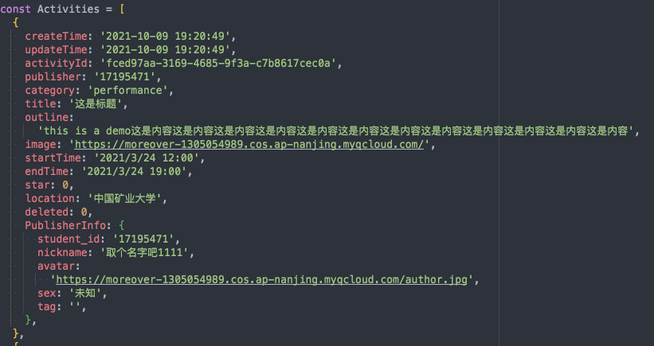

# 复杂组件

## 1.ActivityCard帖子显示卡片

### props

##### `item`活动项目

类型如下

## 2.Star ——点赞按钮

### props

##### `sum`:number` 点赞数

##### `onClick`:function点击触发的函数

## 3.Publisher ——用户信息

### props

##### `publisherInfo`:object 用户信息

## 4.Avatar ——头像

默认40rpx宽高，白色边框

### props

##### `url`:string 头像地址url

##### `size`:number大小，默认40

# 动画组件

## 1.进入动画

### FadeInView 

### OpacityInView

#### props

##### `trigger`:boolean

传入true	动画自动触发

传入false   动画会重置

##### `onFinish`:function

结束后的回调函数

##### `duration`:number

动画持续时间（毫秒）

## 2.
