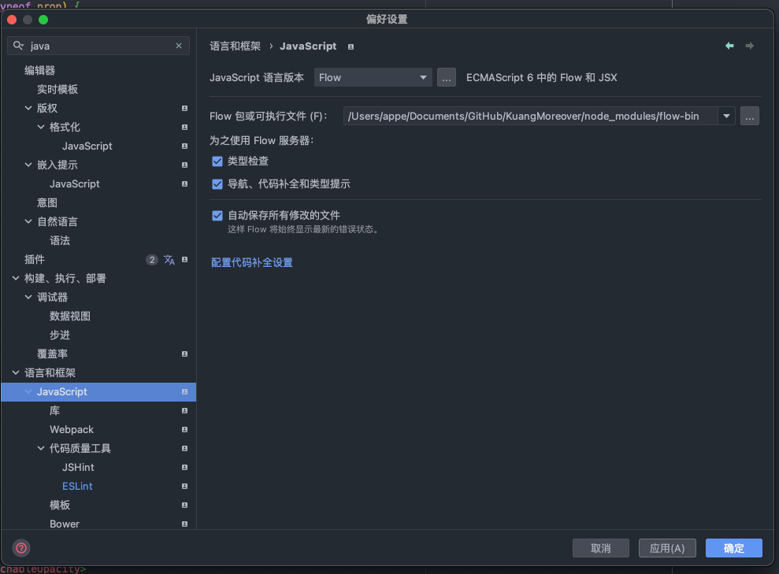

由于最近开发rn第一个大型项目——矿且，随着代码量的增加，关于类型检查的需求就随之而来，要不停使用jsdocs和写文档总结很麻烦。

js中的类型检查的手段有以下，Flow和tsx都是可选项。

- Flow: `// @flow` 向文件顶部添加注释

- TypeScript：将扩展名更改为`.js`扩展`.ts` 名

- React自带的propType设置,虽然使用自带的，简单粗暴且支持最好，但功能少且臃肿

  

# Flow




# PropType

一、 prop-types类型的检测

（1）安装及引入

```react
//安装
npm install prop-types --save
//引入
import PropTypes from 'prop-types';
```

（2）使用

```react
import {Text} from 'react-native';

class DatePicker extends React.Component {
  render() {
    return (
      <Text>测试属性检测，{this.props.age}</Text>
    );
  }
}

DatePicker.defaultProps = {
  age: 0, // 默认值
};

DatePicker.propTypes = {
  age: PropTypes.number, // 这边年龄只允许接收数字类型
};
```

(3)ES7中使用方法示例

```react
class DatePicker extends React.Component {
  //如果没有传递该属性时的默认值
  static defaultProps = {
    age: 17
  }
  //如果传递该属性，该属性值必须为字符串
  static propTypes = {
    age: PropTypes.number
  }
  render() {
    return (
      <div>测试类型检测, {this.props.age}</div>
	   )
  }
}
```


(4)使用isRequired设置属性为必须传递的值

```react
static propTypes={
    name:PropTypes.string.isRequired
}
```

# TypeScript


```typescript
// 一. 对象类型-接口

// 1. 
// 定义了一个接口 Person（行为的抽象，事物的本质），
interface Person1 {
    name:string;
    age:number;
}

// 接着定义了一个变量 pr，其类型就是 Person（接口是类型，对象类型）。约束了定义的变量 pr 属性类型必须和接口 Person 一致。

let pr1:Person1 = { // 以上，赋值的时候，多一个少一个都不行，变量的属性必须和接口的属性保持一致（前提对接口属性没做处理）
    name:'aa',
    age:22
}

// 2. 
// 定义变量的属性个数比接口少，也可以的情况（可少不能多）
interface Person2 {
    name:string;
    age?:number; // ? 可少
}

let pr2: Person2 = {
    name: 'aa'
}

// 3. 可少也能多（也能多）
interface Person3 {
    name:string;
    age?:number;
    [propName:string]:any; // 能多。
    // [propName: string] 定义了任意属性，属性 key 类型为 string;
    // 此时任意属性的类型我们设为 any，所以下面的 isMan 和 address 都能通过；
}

let pr3: Person3 = {
    name: 'aa',
    isMan: true,
    address: 'bb'
}

// 4.只读属性
interface Person4 {
    readonly name:string; //接口定义时，我们在 name 属性前加了关键字readonly，意指该属性只读。使用场景是对象的某些字段只在创建时被赋值，后面不可更改。
    age?:number;
    [propName:string]:any;
}

let pr4: Person4 = {
    name: 'aa', 
    isMan: true,
    address: 'bb'
}

// 变量赋值后，给变量 name 重新赋值，报错;
// 哪怕之前没给它赋值;后面才给 name 赋值，报错；


// 二. 数组类型定义
// 招式一
// 类型[]
let arrayFibonacci: number[] = [1, 1, 2, 3, 5, 8];
let arrayFibonacci3: (number | string | boolean)[] = [1, 1, '2', false, 5, 8]; //联合类型

// 招式二：泛型
// Array<number>
let arrayPush: Array<number> = [1, 2, 3];

// 招式三：接口
interface ArrayNumber {
[index: number]: number //只要 index 的类型是 number，那么值的类型必须是 number
}
let arrayNumberInterface: ArrayNumber = [1, 1, 2, 3, 5];p
```

## 忽略//@ts-ignore

单行忽略

`// @ts-ignore`

忽略全文

`// @ts-nocheck`

取消忽略全文

`// @ts-check`

## 路径别名


