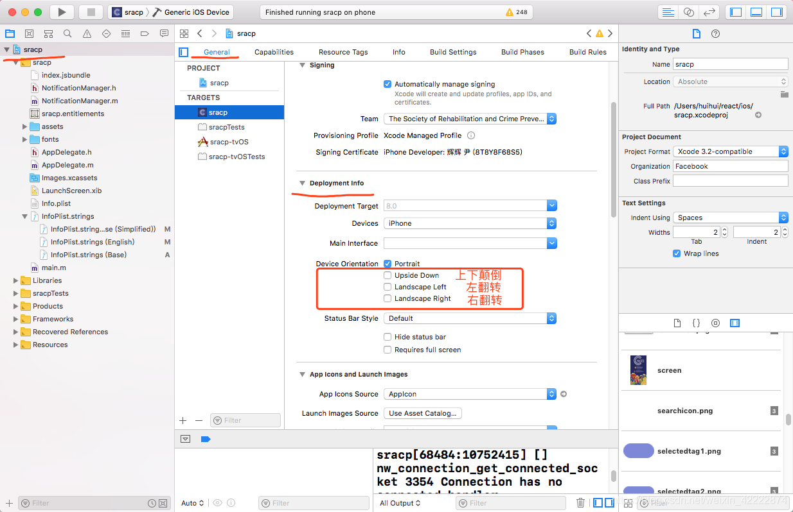

# 全局变量

## 1.新建一个文件，此处命名为Global.js,代码如下

```csharp
const {width, height} = Dimensions.get('window');
const OS = Platform.OS;
const ios = OS === 'ios';
const android = OS === 'android';
const isIPhoneX =
  ios &&
  ((height === 812 && width === 375) || (height === 844 && width === 390));

//Android
const statusBarHeight = (
  ios ? (isIPhoneX ? 47 : 20) : StatusBar.currentHeight
) as number;

// iOS Only
import {NativeModules} from 'react-native';
if (ios) {
  const {StatusBarManager} = NativeModules;
  StatusBarManager.getHeight(statusBarHeight => {
    global.gScreen.statusBarHeight = statusBarHeight?.height;
  });
}
global.gScreen = {
  screen_width: width,
  screen_height: height,
  statusBarHeight: statusBarHeight,
  headerBarHeight: 90,
  onePixelRatio: 1 / PixelRatio.get(),
};
global.gDevice = {
  ios: ios,
  android: android,
  isIPhoneX: isIPhoneX,
};
```

需注意使用的时机，调用global比挂到global上还早是很常见的错误。

## 2.在项目入口处倒入

```jsx
//该全局文件的倒入只需一次，且需要在其他文件声明之前
import Global from './Pages/Common/Global';
```

## 3.全局变量的调用

```rust
const styles = StyleSheet.create({
    container: {
        backgroundColor: "#F5F5F5",
        flex:1
    },
    box: {
        width:gScreen.screen_width
        // width: '90%',
        margin: 10,
    },
  
 
});
```

# debug菜单增加一项

```javascript
DevSettings.addMenuItem('Hello', () => {
  console.log(__DEV__);
});
```

# 调试工具

无论你是Windows环境或者Mac环境，在你的模拟器那里打开调式栏，Ctrl+M / ⌘+D

我们点击Debug，Mac同理，也选择Debug，它会自动打开你的默认浏览器，然后你再打开浏览器的控制台，你的内容就会在这里输出，这方便。


# 禁止屏幕旋转

### android端

android文件下app/src/main/AndroidManifest.xml
添加

```java
android:screenOrientation="portrait"
```


### IOS端

在Xcode项目中把相对应的勾去掉即可


# 