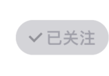

# 需求

来源于关注按钮，同一时间可能存在多个关注按钮，用户详情页或者是文章详情页，

组件在”已关注“和”关注他“ 两种状态间切换




若同一时间有多个按钮则会产生混乱，所以需要对多个组件共享同一个状态。

每个按钮的属性 含有 一个userId

（后面了解到是由于缓存没有及时得到更新产生的问题，导致有的旧状态遗留在页面上）

# 分析

因为按钮分布没有规律，属于非父子组件，也是非爷孙组件。所以组件间通信方式中的 组件间通信，实现方式采用消息订阅 发布者和订阅者

# 实现

## 1.采用第三方EventEmitter

### 优点：1.全局2.方便

### 缺点：只适用于单个组件，其余组件使用需要link到同一个EventEmitter（消息订阅对象）里，这时候有重名的风险。

```react
useEffect(() => {
		const callBack = userIdArg => {
      if (userIdArg === userId) {
        stateChange();
      }
    };
    EventEmitter.addListener('changeState', callBack);
    return () => {
      EventEmitter.removeListener('changeState', callBack);
    };
}, [fadeFollow, fadeFollowCancel, isFollowed, userId]);


onPress={()=>{
  	EventEmitter.emit('changeState',userId);
	}
}
```

我认为的同一个组件中共享状态的最优解！！！


## 2.利用Context 的Provider 和 Consumer

### 优点：不同组件也可以使用同一内容下的state

### 缺点：

### 1.深入了一层，并且Provider的位置很难找到

### 2.综上，如果要全局都存在响应式的话，就是要链接到redux缓存+状态管理的方案。都使用redux中的同一个state，或者建一个全局的state

我比较推荐的方案是，使用useReducer + 根部 context.Provider 做一个全局的userInfo的缓存+状态库，关注按钮都link到同一userId的state中，这样保证 同一userId名下的关注按钮都是同步更新的

# 思考（第二天早晨）

当关注按钮点击 切换状态 之后，然而，页面中滞留的其他的 关注按钮应该同时更新。

未响应的根本原因是 <strong>使用同一内容的组件的state割裂开来</strong>。

在请求到新的state之后，其余的关注按钮就好像缓存的垃圾一样扔然使用着旧的状态。


第一种采用EventEmitter实现状态共享的方法只适用于 同一组件+同一内容

第二种采用Redux的方案，虽然 不同组件+同一内容 ，又大材小用

那有没有最简洁，又最方便，最一劳永逸的方案？

在观看ahooks里的 useRequest中我悟了，利用同一request的内容 + key值，来锁定两个组件使用的是同一数据就可以了。

那就是同一request 确定同一内容，适用于网络请求方面的


