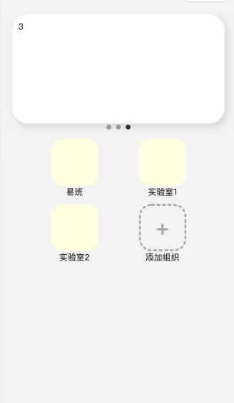

将应用添加到首页，已经添加的就不能再显示了。

ApplicationList_request 	——全部

ApplicationList_added		——已经添加的

（现求）ApplicationList_without

# 取交并补

## 1、ES5：

```javascript


const arr1 = [1,2,3,4,5],
      arr2 = [5,6,7,8,9];

// 交集
let intersection = arr1.filter(function (val) { return arr2.indexOf(val) > -1 })

// 并集
let union = arr1.concat(arr2.filter(function (val) { return !(arr1.indexOf(val) > -1) }))

// 补集 两个数组各自没有的集合
let complement = arr1.filter(function (val) { return !(arr2.indexOf(val) > -1) })
.concat(arr2.filter(function (val) { return !(arr1.indexOf(val) > -1) }))

// 差集 数组arr1相对于arr2所没有的
let diff = arr1.filter(function (val) { return arr2.indexOf(val) === -1 })

console.log('arr1: ', arr1);
console.log('arr2: ', arr2);
console.log('交集', intersection);
console.log('并集', union);
console.log('补集', complement);
console.log('差集', diff);
```
## 2、ES6：

```javascript
const arr1 = [1,2,3,4,5],
      arr2 = [5,6,7,8,9],
      _arr1Set = new Set(arr1),
      _arr2Set = new Set(arr2);


// 交集
let intersection = arr1.filter(item => _arr2Set.has(item))

// 并集
let union = Array.from(new Set([...arr1, ...arr2]))

// 补集 两个数组各自没有的集合
let complement = [...arr1.filter(item => !_arr2Set.has(item)), ...arr2.filter(item => !_arr1Set.has(item))]

// 差集 数组arr1相对于arr2所没有的
let diff = arr1.filter(item => !_arr2Set.has(item))
console.log('arr1: ', arr1);
console.log('arr2: ', arr2);
console.log('交集', intersection);
console.log('并集', union);
console.log('补集', complement);
console.log('差集', diff);

```


# 对象数组去重

根据对象中的keyid去重

例如

```javascript
[{key:"1"},{key:"2"},{key:"2"},{key:"3"}]
```

去重后

```javascript
[{key:"1"},{key:"2"},{key:"3"}]
```


# 两个对象数组求差集

## ts代码：

```typescript
type baseObj = {
  [key: string]: string;
};
/**
 *  求差集合
 * @param arr1 集合1
 * @param arr2 集合2
 * @param key 两个集合中对象的key值
 * @returns arr1 - arr2 (差集)
 */
const withOutByKey = <T extends baseObj>(arr1: T[], arr2: T[], key: string) => {
  const _arr2KeySet = new Set(arr2.map(i => i[key]));
  const diff = arr1.filter(item => !_arr2KeySet.has(item[key]));
  return diff;
};

```


# 数组 转 树

将该返回数据，由数组转树。

```JSON
function TreeNode(value, label, hasChildren = false) {
  this.value = value;
  this.label = label;
  if (hasChildren) this.children = [];
}
function arrayToTree(items) {
  let result = []; // 存放结果集
  const itemMap = {};

  const campusMap = {};
  const groupMap = {};
  for (const item of items) {
    //创建叶节点
    const { id, campus, group, building } = item;
    const key = `${campus}-${group}-${building}`;
    itemMap[key] = new TreeNode(id, key);
    //创建根节点
    campusMap[campus] = campusMap[campus] ?? new TreeNode(campus, campus, true);
    if (groupMap[`${campus}-${group}`] === undefined) {
      groupMap[`${campus}-${group}`] = new TreeNode(group, group, true);
      campusMap[campus].children.push(groupMap[`${campus}-${group}`]);
    }
    groupMap[`${campus}-${group}`].children.push(itemMap[key]);
  }

  result = Object.values(campusMap);
  console.log(JSON.stringify(result));
  return result;
}
```
