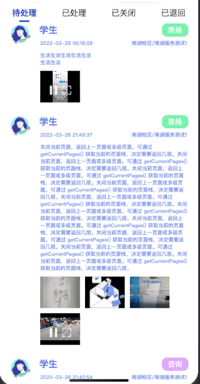

```javascript
const getMessageListByPage = (state, page) => {
  return uni.request({
    url: `${BASE_URL}/message/`,
    method: 'GET',
    data: {
      state,
      page
    }
  })
  .then((res) => {
    const {
      statusCode,
      data
    } = res;
    if (statusCode === 200) {
      return data;
    } else {
      throw new Error("网络错误")
    }
  })
}


// {
//   refresh:boolean,
//   state : 0 1 2 3 
// }
function init_getMessageList(state) {
  let curr = 1;
  return function(refresh) {
    if (refresh === true) {
      curr = 1;
    }
    return getMessageListByPage(state, curr++).then(res => {
      console.log("获取列表页", res);
      return res;
    })
  }
}

```

```javascript
import {
  ref
} from "vue";

const fakeList = (page) => {
  const list = [];
  let num = (Math.random() * 10) | 0;
  for (let i = 0; i < num; i++) {
    list.push({
        value:page ,
    });
  }
  return list;
};


function getListByPage(page) {
  return new Promise((resolve) => {
    setTimeout(() => {
      resolve(fakeList(page));
    }, 1000);
  });
};


let curr = 1;


function getList() {
  return getListByPage(curr++);
}


function usePageList() {
  const list = ref([]);
  const pushList = () => {
    getList().then((res) => {
      list.value.push(...res);
    })
  }
  const clearList = ()=>{
    list.value.length = 0;
  }
  const refresh = ()=>{
    clearList();
    curr = 1;
    pushList();
  }
  return {
    list,
    pushList,
    clearList,
    refresh
  };
};
export default usePageList;
```

