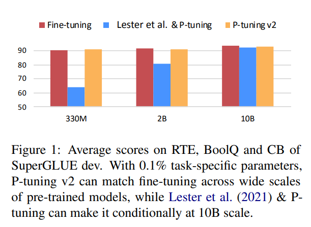
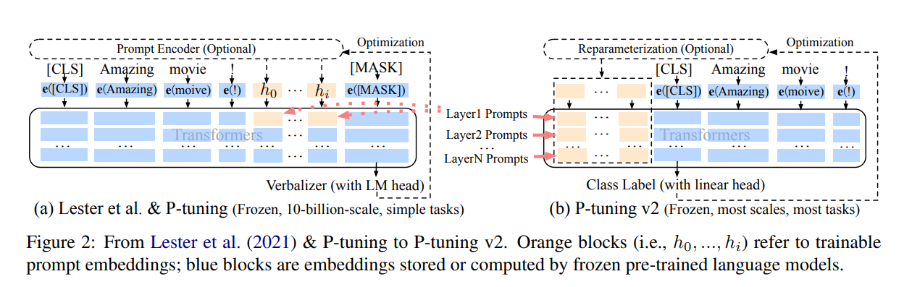

## NLP新范式？P-tuning

又是三个月的拖更，今天把这段时间学的东西更新一下。

从去年开始，NLP届就开始出现一个NLP新范式，提示学习-prompt learning，现在已经发展到了P-tuningV2这个阶段。本文将大致介绍一下prompt的历程，最后将重点放在P-tuningV2上，因为笔者已经将P-tuningV2的代码融合进了笔者的NLP代码框架中。

本文需要一定的NLP基础，还不怎么熟悉BERT的原理与应用还有相关的基础代码的小伙伴，请移步下列推文。

> [BERT的原理与应用](http://mp.weixin.qq.com/s?__biz=Mzg2MzE2MzUxMg==&mid=2247484371&idx=1&sn=197b45d7c1b382cc96430a8f7d818ed1&chksm=ce7d86c4f90a0fd262d2135a5f497b3ff601600f60d3f8daa4ac3ff10a577997d38f58db83ea&scene=21#wechat_redirect)
>
> [BERT与其他预训练模型](http://mp.weixin.qq.com/s?__biz=Mzg2MzE2MzUxMg==&mid=2247484376&idx=1&sn=60f93154ec46ca0def6a5ae094c587f7&chksm=ce7d86cff90a0fd99c42f81bb73f10d922d5fc561161dd103258ba811f49cd8c0d01962f6561&scene=21#wechat_redirect)
>
> [BERT四大下游任务](http://mp.weixin.qq.com/s?__biz=Mzg2MzE2MzUxMg==&mid=2247484387&idx=1&sn=d3aa57bf4eff368366c01d9a4ff28153&chksm=ce7d86f4f90a0fe2ea28936f8408e9db00d43e5a96ec4c093d5426b531c25d4a5b262b2a717f&scene=21#wechat_redirect)
>
> [NLP框架之文本分类(附代码视频）](http://mp.weixin.qq.com/s?__biz=Mzg2MzE2MzUxMg==&mid=2247485421&idx=1&sn=e6aa1af09329953637b978ae7d2b7bc5&chksm=ce7d82faf90a0bec977e04cc214203238c2bae06281cf3aeddad9565202d0fbe79a2ac6b0e0b&scene=21#wechat_redirect)

### 1. 什么是prompt-learning？

prompt-learning本质上其实也是一种微调，但是它和之前的finetuning有些许不同。

* 冻结了预训练模型的权重，减少了训练的内存和时间
* 只用0.1%左右的任务特定参数（prompt）训练，获得了与finetuning相匹配的性能
* 通过prompt-learning提示学习，使微调的过程与预训练的过程上下游一致，没有破坏预训练的训练方式，有效利用预训练的信息。
* 图1的X轴是使用预训练模型的规模，Y轴是训练出来的模型性能

图1

### 2. prompt-learning的架构演变

1. prompt-learning一开始利用的特定参数（prompt）是人工设置的模板，但这样设置的模板是离散且耗费人工。
2. prompt-learning后来通过连续优化的参数插入编码器encoder来训练优化（图2左边模型架构），解决了人工制造模板的困惑，但优化的参数过少，性能无法匹配finetuning（图1的蓝色条形图）
   * 离散的模板采用的特定的字符，然后转换成相应的token embedding去训练优化，最后的embedding通过训练迭代确定的。
   * 如果采用连续的参数，则采用的类似BERT的字典【unused】这些token，最终的embedding也是通过训练迭代确定。
   * 通过对比，我们可以发现，人工设计模板和直接选用【unused】都是通过训练迭代确定，为此并不需要通过人工设计模板，通过迭代训练，连续参数的【unused】也能达到提示的效果。
3. P-tuningV2则提出直接在预训练模型的每一层都添加prompt，以此来增加训练参数(图2右边边模型架构）

> 不同层中的提示作为前缀token加入到输入序列中，并独立于其他层间（而不是由之前的transformer层计算）。
>
> 一方面，通过这种方式，P-tuning v2有更多的可优化的特定任务参数（从0.1%到0.1%-3%），以允许更多的每个任务容量，而它仍然比完整的预训练语言模型小得多；
>
> 另一方面，添加到更深层的提示（例如图2中的LayerN Prompts）可以对输出预测产生更直接和重大的影响，而中间的transformer层则更少。

    

图2

### 3. prompt-learning当前的缺陷

* 使用的预训练模型的规模过大，图1中的P-tuningV2在10亿参数下才勉强和fine-tune持平。
* 特定任务的效果并不是很好，笔者在文本分类、阅读理解、命名实体识别任务中做了实验，阅读理解的任务效果较差，训练的时间较长。
* 当前，笔者认为当前的prompt-learning在工业落地高可用上仍然有很大差距，但做做研究倒也没啥问题。
* 笔者在本文只是大致介绍了prompt-learning，其他类似prompt-learning的方式也很多，但万变不离其宗，尤其是在实现代码的过程中，笔者发现改代码的部分只是在encoder这一部分进行修改，输入和输出并没有太大的变化。

### 4. 代码学习

1. 稳定运营️①年的NLP高阶训练营

   > [NLP高阶课程（含代码与视频）](https://mp.weixin.qq.com/s/rHJGBIA8rvCMFXDtd3WDyQ)

2. 覆盖NLP 所有下游任务

   > 文本分类、阅读理解、命名实体识别、文本生成、关系抽取、loss应用与蒸馏
   > ptuning三件套：文本分类、阅读理解、命名实体识别

3. 理论学习、竞赛、论文实验、大厂上班一应俱全
4. 一套代码学习多个项目，代码复用性高、解耦性强、采用pytorch框架快速上手，学习成本低（代码来源：国家级竞赛全国前三获奖项目、顶级会议与论文）
5. ️有问题微信️一对一回复，杜绝群聊水信息
6. 秋招面试问题根据个人情况定制化回复
7. 截止目前，服务人群覆盖清北、985、211、港科港中文等知名境内外名校与大量秋招面试人群，加入训练营🉑️先试学一套核心框架
8. ️加入微信：xilan912427166

